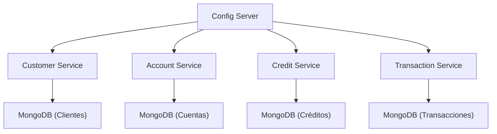

# Sistema Bancario con Microservicios OMARCODE

[](https://github.com/<Omarrivv>/<https://github.com/Omarrivv/prueba_bcp_demos>/actions/workflows/ci-microservices.yml)

> Cambia <Omarrivv> y <https://github.com/Omarrivv/prueba_bcp_demos> por tu usuario y nombre de repo en GitHub para que los badges funcionen correctamente.

## Descripción General

Este proyecto implementa un sistema bancario utilizando una arquitectura de microservicios, orientado a la gestión de clientes, productos bancarios (cuentas y créditos), operaciones y configuración centralizada. El sistema está diseñado para cumplir con los requisitos de negocio y técnicos especificados en el contexto bancario.

## Arquitectura de Microservicios



### Microservicios propuestos

- **customer-service**: Gestión de clientes personales y empresariales.
- **account-service**: Manejo de cuentas bancarias (ahorro, corriente, plazo fijo).
- **credit-service**: Gestión de créditos y tarjetas de crédito.
- **transaction-service**: Registro de movimientos, depósitos, retiros y pagos.
- **config-server**: Servidor centralizado de configuración.

Cada microservicio tiene su propio repositorio y base de datos MongoDB (database per service).

## Tecnologías Utilizadas

- **Java 17+**
- **Spring Boot WebFlux** (programación reactiva)
- **Spring Data MongoDB**
- **Maven** (gestión de dependencias)
- **Spring Cloud Config Server** (configuración centralizada)
- **Lombok** (reducción de boilerplate)
- **Logback** (logging)
- **OpenAPI** (documentación de APIs)

## Reglas de Negocio

### Clientes Personales

- Solo pueden tener una cuenta de ahorro, una cuenta corriente o múltiples cuentas a plazo fijo.
- Solo un crédito personal.
- Puede tener tarjeta de crédito personal.

### Clientes Empresariales

- Solo cuentas corrientes (pueden tener varias).
- Múltiples créditos empresariales.
- Puede tener tarjeta de crédito empresarial.
- Las cuentas pueden tener varios titulares y firmantes autorizados.

### Productos Bancarios

- **Ahorro**: Sin comisión de mantenimiento, límite de movimientos mensuales.
- **Corriente**: Con comisión de mantenimiento, sin límite de movimientos.
- **Plazo fijo**: Sin comisión, solo un movimiento en un día específico del mes.
- **Créditos**: Personales (uno por persona), empresariales (varios por empresa).
- **Tarjetas de crédito**: Personales o empresariales, con límite de crédito.

### Operaciones

- Depósitos y retiros en cuentas bancarias.
- Pagos de créditos.
- Consumos con tarjeta de crédito.
- Consulta de saldos y movimientos.

## Requerimientos Técnicos

- Cada microservicio implementa controladores REST (CRUD completo).
- Uso de inyección de dependencias.
- Configuración externalizada (no hardcodeada).
- Documentación OpenAPI.
- Logging adecuado con Logback.
- Uso de Spring Data (sin @Query personalizada).
- Pruebas mediante Postman (no interfaz gráfica).

## Estructura de Carpetas Sugerida

```
/customer-service
/account-service
/credit-service
/transaction-service
/config-server
```

Cada carpeta debe contener un proyecto Spring Boot independiente, con su propio `pom.xml` y configuración.

## Instrucciones de Despliegue

1. Clona cada microservicio en su propio repositorio.
2. Configura el `config-server` y define los archivos de configuración externalizados.
3. Levanta primero el `config-server`.
4. Levanta los microservicios apuntando al `config-server`.
5. Asegúrate de tener instancias de MongoDB para cada microservicio.
6. Prueba los endpoints usando Postman.

## Diagramas

- Mantén un diagrama de arquitectura en draw.io.
- Crea diagramas de secuencia para cada microservicio.

## Recomendaciones

- Prioriza las funcionalidades obligatorias.
- Usa lambdas y streams de Java 8+ donde sea posible.
- Comenta clases y métodos.
- Sube avances diarios a GitHub.

## Contacto y Soporte

Para dudas o soporte, consulta la documentación de Spring Boot, MongoDB y Spring Cloud Config.

---

Este README sirve como guía inicial para el desarrollo y despliegue del sistema bancario basado en microservicios. ¡Éxito en tu implementación!

## Endpoints REST de los Microservicios

A continuación se listan los endpoints principales de cada microservicio para que puedas probarlos fácilmente desde Postman o cualquier cliente HTTP.

### 1. Customer Service (Clientes)

- **Base URL:** http://localhost:8081/api/customers

| Método | Endpoint            | Descripción              | Ejemplo Body (JSON)                                                                                                                                  |
| ------- | ------------------- | ------------------------- | ---------------------------------------------------------------------------------------------------------------------------------------------------- |
| GET     | /api/customers      | Listar todos los clientes | -                                                                                                                                                    |
| GET     | /api/customers/{id} | Obtener cliente por ID    | -                                                                                                                                                    |
| POST    | /api/customers      | Crear cliente             | `{ "documentNumber": "12345678", "name": "Juan Perez", "type": "PERSONAL", "email": "juan@mail.com", "phone": "999999999", "address": "Calle 1" }` |
| PUT     | /api/customers/{id} | Actualizar cliente        | (igual que POST)                                                                                                                                     |
| DELETE  | /api/customers/{id} | Eliminar cliente          | -                                                                                                                                                    |

### 2. Account Service (Cuentas Bancarias)

- **Base URL:** http://localhost:8082/api/accounts

| Método | Endpoint           | Descripción             | Ejemplo Body (JSON)                                                                                                                                                                                                    |
| ------- | ------------------ | ------------------------ | ---------------------------------------------------------------------------------------------------------------------------------------------------------------------------------------------------------------------- |
| GET     | /api/accounts      | Listar todas las cuentas | -                                                                                                                                                                                                                      |
| GET     | /api/accounts/{id} | Obtener cuenta por ID    | -                                                                                                                                                                                                                      |
| POST    | /api/accounts      | Crear cuenta             | `{ "accountNumber": "001", "type": "SAVINGS", "customerId": "<id_cliente>", "holders": [], "signers": [], "balance": 100.0, "maintenanceFee": 0.0, "movementLimit": 5, "allowedMovementDay": null, "active": true }` |
| PUT     | /api/accounts/{id} | Actualizar cuenta        | (igual que POST)                                                                                                                                                                                                       |
| DELETE  | /api/accounts/{id} | Eliminar cuenta          | -                                                                                                                                                                                                                      |

### 3. Credit Service (Créditos y Tarjetas)

- **Base URL:** http://localhost:8083/api/credits

| Método | Endpoint          | Descripción                | Ejemplo Body (JSON)                                                                                                                                           |
| ------- | ----------------- | --------------------------- | ------------------------------------------------------------------------------------------------------------------------------------------------------------- |
| GET     | /api/credits      | Listar todos los créditos  | -                                                                                                                                                             |
| GET     | /api/credits/{id} | Obtener crédito por ID     | -                                                                                                                                                             |
| POST    | /api/credits      | Crear crédito/tarjeta      | `{ "customerId": "<id_cliente>", "type": "PERSONAL_LOAN", "amount": 1000.0, "balance": 1000.0, "interestRate": 0.15, "creditLimit": null, "active": true }` |
| PUT     | /api/credits/{id} | Actualizar crédito/tarjeta | (igual que POST)                                                                                                                                              |
| DELETE  | /api/credits/{id} | Eliminar crédito/tarjeta   | -                                                                                                                                                             |

### 4. Transaction Service (Movimientos y Operaciones)

- **Base URL:** http://localhost:8084/api/transactions

| Método | Endpoint               | Descripción                   | Ejemplo Body (JSON)                                                                                                                                                                          |
| ------- | ---------------------- | ------------------------------ | -------------------------------------------------------------------------------------------------------------------------------------------------------------------------------------------- |
| GET     | /api/transactions      | Listar todas las transacciones | -                                                                                                                                                                                            |
| GET     | /api/transactions/{id} | Obtener transacción por ID    | -                                                                                                                                                                                            |
| POST    | /api/transactions      | Crear transacción             | `{ "productId": "<id_producto>", "productType": "ACCOUNT", "type": "DEPOSIT", "amount": 100.0, "date": "2024-07-14T15:00:00", "description": "Depósito inicial", "balanceAfter": 200.0 }` |
| PUT     | /api/transactions/{id} | Actualizar transacción        | (igual que POST)                                                                                                                                                                             |
| DELETE  | /api/transactions/{id} | Eliminar transacción          | -                                                                                                                                                                                            |

---

**Notas para pruebas:**

- Cambia los valores de ejemplo por los datos reales de tu base.
- Usa los IDs generados por los POST para probar los GET, PUT y DELETE.
- Puedes importar estos endpoints en Postman y probar cada operación CRUD.
- Todos los endpoints aceptan y devuelven JSON.

---

¡Listo para probar todo tu sistema bancario por microservicios! Si necesitas ejemplos de colecciones de Postman o ayuda con pruebas avanzadas, avísame.

¡Por supuesto! Aquí tienes ejemplos de cómo probar **todos los endpoints principales** de tus microservicios usando `curl` desde la terminal.

---

## 1. **Customer Service (Clientes)**

### Listar todos los clientes

```sh
curl -X GET http://localhost:8081/api/customers
```

### Obtener cliente por ID

```sh
curl -X GET http://localhost:8081/api/customers/{id}
```

### Crear cliente

```sh
curl -X POST http://localhost:8081/api/customers \
  -H "Content-Type: application/json" \
  -d '{"documentNumber":"12345678","name":"Juan Perez","type":"PERSONAL","email":"juan@mail.com","phone":"999999999","address":"Calle 1"}'
```

### Actualizar cliente

```sh
curl -X PUT http://localhost:8081/api/customers/{id} \
  -H "Content-Type: application/json" \
  -d '{"documentNumber":"12345678","name":"Juan Perez","type":"PERSONAL","email":"juan@mail.com","phone":"999999999","address":"Calle 1"}'
```

### Eliminar cliente

```sh
curl -X DELETE http://localhost:8081/api/customers/{id}
```

---

## 2. **Account Service (Cuentas Bancarias)**

### Listar todas las cuentas

```sh
curl -X GET http://localhost:8082/api/accounts
```

### Obtener cuenta por ID

```sh
curl -X GET http://localhost:8082/api/accounts/{id}
```

### Crear cuenta

```sh
curl -X POST http://localhost:8082/api/accounts \
  -H "Content-Type: application/json" \
  -d '{"accountNumber":"001","type":"SAVINGS","customerId":"<id_cliente>","holders":[],"signers":[],"balance":100.0,"maintenanceFee":0.0,"movementLimit":5,"allowedMovementDay":null,"active":true}'
```

### Actualizar cuenta

```sh
curl -X PUT http://localhost:8082/api/accounts/{id} \
  -H "Content-Type: application/json" \
  -d '{"accountNumber":"001","type":"SAVINGS","customerId":"<id_cliente>","holders":[],"signers":[],"balance":100.0,"maintenanceFee":0.0,"movementLimit":5,"allowedMovementDay":null,"active":true}'
```

### Eliminar cuenta

```sh
curl -X DELETE http://localhost:8082/api/accounts/{id}
```

---

## 3. **Credit Service (Créditos y Tarjetas)**

### Listar todos los créditos

```sh
curl -X GET http://localhost:8083/api/credits
```

### Obtener crédito por ID

```sh
curl -X GET http://localhost:8083/api/credits/{id}
```

### Crear crédito/tarjeta

```sh
curl -X POST http://localhost:8083/api/credits \
  -H "Content-Type: application/json" \
  -d '{"customerId":"<id_cliente>","type":"PERSONAL_LOAN","amount":1000.0,"balance":1000.0,"interestRate":0.15,"creditLimit":null,"active":true}'
```

### Actualizar crédito/tarjeta

```sh
curl -X PUT http://localhost:8083/api/credits/{id} \
  -H "Content-Type: application/json" \
  -d '{"customerId":"<id_cliente>","type":"PERSONAL_LOAN","amount":1000.0,"balance":1000.0,"interestRate":0.15,"creditLimit":null,"active":true}'
```

### Eliminar crédito/tarjeta

```sh
curl -X DELETE http://localhost:8083/api/credits/{id}
```

---

## 4. **Transaction Service (Movimientos y Operaciones)**

### Listar todas las transacciones

```sh
curl -X GET http://localhost:8084/api/transactions
```

### Obtener transacción por ID

```sh
curl -X GET http://localhost:8084/api/transactions/{id}
```

### Crear transacción

```sh
curl -X POST http://localhost:8084/api/transactions \
  -H "Content-Type: application/json" \
  -d '{"productId":"<id_producto>","productType":"ACCOUNT","type":"DEPOSIT","amount":100.0,"date":"2024-07-14T15:00:00","description":"Depósito inicial","balanceAfter":200.0}'
```

### Actualizar transacción

```sh
curl -X PUT http://localhost:8084/api/transactions/{id} \
  -H "Content-Type: application/json" \
  -d '{"productId":"<id_producto>","productType":"ACCOUNT","type":"DEPOSIT","amount":100.0,"date":"2024-07-14T15:00:00","description":"Depósito inicial","balanceAfter":200.0}'
```

### Eliminar transacción

```sh
curl -X DELETE http://localhost:8084/api/transactions/{id}
```

---

**Notas:**

- Cambia `{id}` o `<id_cliente>`/`<id_producto>` por los valores reales que obtengas al crear entidades.
- Si usas Windows, puedes usar comillas dobles para los JSON como en los ejemplos.
- Todos los endpoints aceptan y devuelven JSON.

¿Quieres ejemplos de scripts para automatizar pruebas o necesitas ayuda con algún error de curl?
¡Avísame!

¡Perfecto! En **Windows PowerShell**, la forma correcta de hacer peticiones HTTP (como POST, PUT, etc.) es usando `Invoke-WebRequest` o `Invoke-RestMethod`.
Aquí tienes ejemplos actualizados para **PowerShell** para todos los endpoints principales de tus microservicios:

---

## Pruebas de Endpoints con PowerShell (Windows)

Si usas **Windows**, puedes probar todos los endpoints de tus microservicios usando PowerShell con los comandos `Invoke-WebRequest` o `Invoke-RestMethod`.

### ¿Cuál usar?

- **Invoke-WebRequest**: Devuelve la respuesta como HTML o texto.
- **Invoke-RestMethod**: Devuelve la respuesta como objeto PowerShell (ideal para ver JSON).

### Ejemplo general para POST (crear entidad):

```powershell
Invoke-WebRequest -Uri http://localhost:8081/api/customers `
  -Method POST `
  -Headers @{ "Content-Type" = "application/json" } `
  -Body '{ "documentNumber": "12345678", "name": "Juan Perez", "type": "PERSONAL", "email": "juan@mail.com", "phone": "999999999", "address": "Calle 1" }'
```

### Ejemplo general para ver la respuesta en JSON:

```powershell
Invoke-RestMethod -Uri http://localhost:8081/api/customers -Method GET
```

### Para ver solo el contenido JSON con Invoke-WebRequest:

```powershell
(Invoke-WebRequest -Uri http://localhost:8081/api/customers -Method GET).Content
```

---

## Ejemplos completos para cada microservicio

### 1. Customer Service (Clientes)

#### Crear cliente

```powershell
Invoke-WebRequest -Uri http://localhost:8081/api/customers `
  -Method POST `
  -Headers @{ "Content-Type" = "application/json" } `
  -Body '{ "documentNumber": "12345678", "name": "Juan Perez", "type": "PERSONAL", "email": "juan@mail.com", "phone": "999999999", "address": "Calle 1" }'
```

#### Listar todos los clientes

```powershell
Invoke-RestMethod -Uri http://localhost:8081/api/customers -Method GET
```

#### Obtener cliente por ID

```powershell
Invoke-RestMethod -Uri http://localhost:8081/api/customers/{id} -Method GET
```

#### Actualizar cliente

```powershell
Invoke-WebRequest -Uri http://localhost:8081/api/customers/{id} `
  -Method PUT `
  -Headers @{ "Content-Type" = "application/json" } `
  -Body '{ "documentNumber": "12345678", "name": "Juan Perez", "type": "PERSONAL", "email": "juan@mail.com", "phone": "999999999", "address": "Calle 1" }'
```

#### Eliminar cliente

```powershell
Invoke-WebRequest -Uri http://localhost:8081/api/customers/{id} -Method DELETE
```

---

### 2. Account Service (Cuentas Bancarias)

#### Crear cuenta

```powershell
Invoke-WebRequest -Uri http://localhost:8082/api/accounts `
  -Method POST `
  -Headers @{ "Content-Type" = "application/json" } `
  -Body '{ "accountNumber": "001", "type": "SAVINGS", "customerId": "<id_cliente>", "holders": [], "signers": [], "balance": 100.0, "maintenanceFee": 0.0, "movementLimit": 5, "allowedMovementDay": null, "active": true }'
```

#### Listar todas las cuentas

```powershell
Invoke-RestMethod -Uri http://localhost:8082/api/accounts -Method GET
```

#### Obtener cuenta por ID

```powershell
Invoke-RestMethod -Uri http://localhost:8082/api/accounts/{id} -Method GET
```

#### Actualizar cuenta

```powershell
Invoke-WebRequest -Uri http://localhost:8082/api/accounts/{id} `
  -Method PUT `
  -Headers @{ "Content-Type" = "application/json" } `
  -Body '{ "accountNumber": "001", "type": "SAVINGS", "customerId": "<id_cliente>", "holders": [], "signers": [], "balance": 100.0, "maintenanceFee": 0.0, "movementLimit": 5, "allowedMovementDay": null, "active": true }'
```

#### Eliminar cuenta

```powershell
Invoke-WebRequest -Uri http://localhost:8082/api/accounts/{id} -Method DELETE
```

---

### 3. Credit Service (Créditos y Tarjetas)

#### Crear crédito/tarjeta

```powershell
Invoke-WebRequest -Uri http://localhost:8083/api/credits `
  -Method POST `
  -Headers @{ "Content-Type" = "application/json" } `
  -Body '{ "customerId": "<id_cliente>", "type": "PERSONAL_LOAN", "amount": 1000.0, "balance": 1000.0, "interestRate": 0.15, "creditLimit": null, "active": true }'
```

#### Listar todos los créditos

```powershell
Invoke-RestMethod -Uri http://localhost:8083/api/credits -Method GET
```

#### Obtener crédito por ID

```powershell
Invoke-RestMethod -Uri http://localhost:8083/api/credits/{id} -Method GET
```

#### Actualizar crédito/tarjeta

```powershell
Invoke-WebRequest -Uri http://localhost:8083/api/credits/{id} `
  -Method PUT `
  -Headers @{ "Content-Type" = "application/json" } `
  -Body '{ "customerId": "<id_cliente>", "type": "PERSONAL_LOAN", "amount": 1000.0, "balance": 1000.0, "interestRate": 0.15, "creditLimit": null, "active": true }'
```

#### Eliminar crédito/tarjeta

```powershell
Invoke-WebRequest -Uri http://localhost:8083/api/credits/{id} -Method DELETE
```

---

### 4. Transaction Service (Movimientos y Operaciones)

#### Crear transacción

```powershell
Invoke-WebRequest -Uri http://localhost:8084/api/transactions `
  -Method POST `
  -Headers @{ "Content-Type" = "application/json" } `
  -Body '{ "productId": "<id_producto>", "productType": "ACCOUNT", "type": "DEPOSIT", "amount": 100.0, "date": "2024-07-14T15:00:00Z" }'
```

#### Listar todas las transacciones

```powershell
Invoke-RestMethod -Uri http://localhost:8084/api/transactions -Method GET
```

#### Obtener transacción por ID

```powershell
Invoke-RestMethod -Uri http://localhost:8084/api/transactions/{id} -Method GET
```

#### Actualizar transacción

```powershell
Invoke-WebRequest -Uri http://localhost:8084/api/transactions/{id} `
  -Method PUT `
  -Headers @{ "Content-Type" = "application/json" } `
  -Body '{ "productId": "<id_producto>", "productType": "ACCOUNT", "type": "DEPOSIT", "amount": 100.0, "date": "2024-07-14T15:00:00Z", "description": "Depósito inicial", "balanceAfter": 200.0 }'
```

#### Eliminar transacción

```powershell
Invoke-WebRequest -Uri http://localhost:8084/api/transactions/{id} -Method DELETE
```

---

**Recomendaciones para PowerShell:**

- Usa `Invoke-RestMethod` para ver la respuesta como objeto JSON.
- Usa `Invoke-WebRequest` si solo quieres ver el texto o necesitas más control sobre la respuesta.
- Cambia `{id}`, `<id_cliente>`, `<id_producto>` por los valores reales que obtengas al crear entidades.
- Si la respuesta es muy larga, puedes agregar `| ConvertTo-Json -Depth 10` para formatear la salida.

---

¡Con esto puedes probar todos tus endpoints desde PowerShell en Windows de forma profesional y sencilla!

## Ejemplos reales de pruebas con PowerShell y JSON válidos

A continuación se muestran ejemplos **reales y probados** para crear entidades en cada microservicio usando PowerShell. Presta atención al formato de fecha y a los campos obligatorios.

### 1. Crear un cliente (customer-service)

```powershell
Invoke-WebRequest -Uri http://localhost:8081/api/customers `
  -Method POST `
  -Headers @{ "Content-Type" = "application/json" } `
  -Body '{ "documentNumber": "12345678", "name": "Juan Perez", "type": "PERSONAL", "email": "juan@mail.com", "phone": "999999999", "address": "Calle 1" }'
```

### 2. Crear una cuenta bancaria (account-service)

```powershell
Invoke-WebRequest -Uri http://localhost:8082/api/accounts `
  -Method POST `
  -Headers @{ "Content-Type" = "application/json" } `
  -Body '{ "accountNumber": "001", "type": "SAVINGS", "customerId": "68755187cc491551f46fdf16", "holders": [], "signers": [], "balance": 100.0, "maintenanceFee": 0.0, "movementLimit": 5, "allowedMovementDay": null, "active": true }'
```

### 3. Crear un crédito (credit-service)

```powershell
Invoke-WebRequest -Uri http://localhost:8083/api/credits `
  -Method POST `
  -Headers @{ "Content-Type" = "application/json" } `
  -Body '{ "customerId": "68755187cc491551f46fdf16", "type": "PERSONAL_LOAN", "amount": 1000.0, "balance": 1000.0, "interestRate": 0.15, "creditLimit": null, "active": true }'
```

### 4. Crear una transacción (transaction-service)

> **¡Importante!** El campo `date` debe estar en formato ISO 8601 con `Z` al final (ejemplo: `2024-07-14T15:00:00Z`). No incluyas campos opcionales si no son requeridos por el backend.

```powershell
Invoke-WebRequest -Uri http://localhost:8084/api/transactions `
  -Method POST `
  -Headers @{ "Content-Type" = "application/json" } `
  -Body '{ "productId": "687552c294b9b36759e5da78", "productType": "ACCOUNT", "type": "DEPOSIT", "amount": 100.0, "date": "2024-07-14T15:00:00Z" }'
```

---

## Recomendaciones y advertencias

- **Siempre usa el formato de fecha ISO con `Z`** para el campo `date` en transacciones.
- **No incluyas campos nulos u opcionales** si no son requeridos por el backend.
- **productId** en transacciones debe ser el ID real de la cuenta o crédito, según el tipo de operación.
- Si recibes un error 400, revisa los logs del backend y asegúrate de que los nombres y tipos de los campos coincidan exactamente con los esperados.

---

Con estos ejemplos y advertencias, puedes probar tu sistema bancario por microservicios de forma segura y sin errores de formato.
